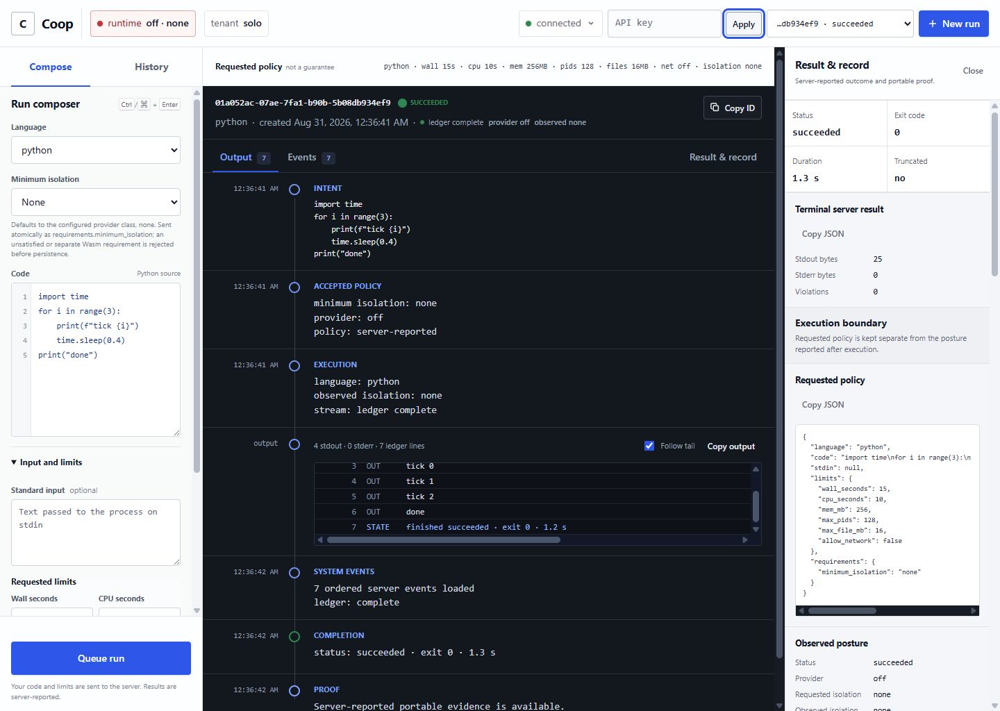

<div align="center">

# Coop

### Give your AI agent a safer place to run code

Coop runs short Python, Node.js, and Bash jobs in a separate service, applies
the limits you choose, and gives you a clear record of what happened.

[](https://github.com/sambai-dev/coop/actions/workflows/ci.yml)
[](https://github.com/sambai-dev/coop/releases)
[](LICENSE)
[](#try-coop-in-five-minutes)

[Try it](#try-coop-in-five-minutes) ·
[How it works](#what-coop-does) ·
[Agent integrations](#agent-and-harness-integration) ·
[Production](#production-on-a-dedicated-linux-x86_64-vm) ·
[Documentation](#documentation)

</div>



## What Coop does

Your agent—or any application—sends Coop a short job. Coop then:

1. checks who is asking and what they are allowed to do;
2. applies server-controlled time and resource limits;
3. runs the job using the configured execution boundary;
4. streams the output into the operator console; and
5. keeps a result and evidence record you can inspect later.

You do **not** need to understand Rust or the Coop source code to use the
prebuilt app. You only need a supported computer, a runtime such as Python,
and a browser.

## Try Coop in five minutes

This path uses a prebuilt app. You do not need Rust, a source checkout, or an
understanding of Coop's internals.

> [!WARNING]
> This quick start is an **unisolated local demo for code you trust**. Keep it on
> `127.0.0.1`; do not expose it to a network or use it for hostile code.

### 1. Download the app

Open the [v0.5.0 release](https://github.com/sambai-dev/coop/releases/tag/v0.5.0),
then choose the archive for your computer:

| Your computer | Download |
|---|---|
| Windows, 64-bit | [`coop-x86_64-pc-windows-msvc.zip`](https://github.com/sambai-dev/coop/releases/download/v0.5.0/coop-x86_64-pc-windows-msvc.zip) |
| Mac with Apple silicon | [`coop-aarch64-apple-darwin.tar.gz`](https://github.com/sambai-dev/coop/releases/download/v0.5.0/coop-aarch64-apple-darwin.tar.gz) |
| Linux x86_64 | [`coop-x86_64-unknown-linux-musl.tar.gz`](https://github.com/sambai-dev/coop/releases/download/v0.5.0/coop-x86_64-unknown-linux-musl.tar.gz) |

Extract the archive. Install Python if you want to run the included Python
example; Coop automatically shows only the runtimes that work on your machine.

### 2. Start Coop

Open a terminal in the extracted folder and run one of these commands.

Windows PowerShell:

```powershell
$env:COOP_SANDBOX = "off"
$env:COOP_JOBS_ROOT = Join-Path (Get-Location) ".coop-dev\jobs"
.\coop.exe
```

macOS or Linux:

```bash
chmod +x coop coop-verify
COOP_SANDBOX=off COOP_JOBS_ROOT="$PWD/.coop-dev/jobs" ./coop
```

Leave that terminal open. Coop is now running only on your computer.

### 3. Use the console

1. Open <http://127.0.0.1:7300>.
2. Enter `coop-dev-key` in **API key**, then select **Apply**.
3. Keep the included example or paste a short trusted script.
4. Select **Queue run**.
5. Watch the transcript, then open **Result & record**.

The red `off · none` label is expected in this demo. It tells you honestly that
the local process is **not sandboxed**.

### Console guide

| Area | What it is for |
|---|---|
| **Compose** | Choose a language, paste code, and set simple limits. |
| **History** | Reopen earlier jobs and see whether they succeeded. |
| **Transcript** | Follow accepted policy, execution, output, completion, and proof in order. |
| **Result & record** | Inspect the final outcome and download available evidence. |
| **Runtime label** | See the isolation Coop actually observed—not just what was requested. |

## Connect an AI agent

Coop works with Hermes, OpenClaw, Codex, and other MCP-compatible hosts through
the included `coop-mcp` adapter.

1. Start Coop using the demo above or the production deployment.
2. Install the verified Python wheel from the same release.
3. Copy the configuration for your agent and restart it.

Use the copy-ready guides for [Hermes](integrations/hermes/config.snippet.yaml),
[OpenClaw](integrations/openclaw/openclaw.snippet.json5), or a
[generic MCP host](integrations/README.md#generic-mcp-host). The detailed,
fail-closed installation path is in [Agent and harness integration](#agent-and-harness-integration).

## Is Coop right for my task?

| Use Coop for | Keep using your agent's normal workspace for |
|---|---|
| short generated or user-supplied scripts | editing a repository |
| stateless transforms, checks, and evaluators | persistent files and package installation |
| work that needs limits, cancellation, or an evidence record | browsers, terminals, ports, and long-running services |
| execution that must cross a separately operated API boundary | trusted work already isolated well enough by the agent |

Using both is normal. Your agent decides what work is needed; Coop independently
decides whether and how a submitted job may run.

## Before you run untrusted code

The quick start above is intentionally not a sandbox. For mutually untrusted
jobs, use the guarded production profile on a dedicated Linux x86_64 VM and
complete every deployment check.

> [!IMPORTANT]
> The `gVisor` production profile is Linux x86_64-only. macOS, Windows, and other Linux architectures can run only the same-trust subprocess backend. The outer
> Coop service is privileged even when each job uses gVisor, so it belongs on a
> dedicated VM. Read [the security boundary](docs/security-boundary.md) before
> accepting untrusted jobs.

> [!NOTE]
> **Current release:** [v0.5.0](https://github.com/sambai-dev/coop/releases/tag/v0.5.0).
> Its exact eight-asset set includes checksums, a combined artifact-scoped SPDX
> SBOM, GitHub SBOM/provenance attestations, and the offline `coop-verify`
> verifier inside each platform archive. Older release lines are unsupported
> for new deployments.

## Why Coop exists

Most agent sandboxes protect a development workspace. Coop adds a separately
operated execution boundary for short, risky, or user-supplied jobs without
letting the model hold the Coop key or choose its own server, tenant, language
allowlist, or required isolation posture.

Without Coop, a tool call often ends as `subprocess.run(model_text)` inside the
agent process or a long-lived container. The application then has to invent
authentication, resource ceilings, cancellation, output bounds, tenant
concurrency, reconnectable streaming, and an audit record.

With Coop, the trusted adapter submits once and receives a job ID. Operators
can answer five concrete questions: what ran, who submitted it, which controls
actually became effective, what output or violations were observed, and how
the run ended. Evidence survives failure, timeout, OOM, and cancellation.

```text
you → AI agent or app → coop-mcp or SDK → Coop → short job
       decides what      submits safely    policy + evidence
```

### What ships

- one authenticated HTTP API for submit, inspect, cancel, wait, and event history
- live WebSocket output with one-use stream tickets and persisted history before live frames
- scoped indexed credentials or RFC 9068 JWTs, with legacy per-tenant keys retained for migration
- fair per-tenant admission, aggregate memory limits, logical storage quotas, and a disk-reserve watermark
- server-clamped wall-time, CPU, memory, process, and file limits
- a per-job gVisor OCI provider plus the Linux x86_64 namespace fallback, both with networking denied
- an operator dashboard served from the binary
- a SQLite schema-v4 job/evidence store with configurable retention, idempotent submission, and per-job hash chains
- terminal evidence receipts binding policy, runtime posture, output digests, outcome, and chain head
- Ed25519-signed DSSE/in-toto envelopes, exact result artifacts, restart backfill, and offline verification
- bounded OpenMetrics telemetry plus W3C Trace Context correlation
- stdlib-only Python and dependency-free TypeScript clients
- a dependency-free, concurrent `coop-mcp` stdio server supporting MCP 2026 Tasks and legacy hosts

The event chain remains server-verifiable operational evidence. A signed envelope additionally proves that the configured Coop key asserted the authoritative tenant, exact receipt, and result digest. It does **not** prove deterministic re-execution, trusted hardware, remote attestation, or WORM storage; distribute or pin the public key out of band rather than trusting its API `key_id` hint.

## Common questions

| Question | Answer |
|---|---|
| Do I need Rust? | **No.** Download a prebuilt release unless you want to contribute to Coop itself. |
| Do I need an AI model? | **No.** Any application can call Coop through HTTP or an SDK. |
| Can I use Hermes, OpenClaw, or Codex? | **Yes.** Use the included MCP adapter and copy-ready configuration. |
| Does Coop replace my agent's normal workspace? | **No.** Keep repository editing in the workspace and send short execution jobs to Coop. |
| Is the five-minute demo safe for untrusted code? | **No.** It is loopback-only and unisolated. Use the guarded production deployment for mutually untrusted jobs. |

## Build from source (optional)

Most users should use the [prebuilt quick start](#try-coop-in-five-minutes).
This section is only for contributors or operators who specifically want to
compile Coop themselves. Install Rust 1.98 and the runtimes you intend to use:

```bash
git clone https://github.com/sambai-dev/coop.git
cd coop
COOP_SANDBOX=off \
COOP_JOBS_ROOT="$PWD/.coop-dev/jobs" \
cargo run --locked -p coop-server
```

PowerShell:

```powershell
git clone https://github.com/sambai-dev/coop.git
Set-Location coop
$env:COOP_SANDBOX = "off"
$env:COOP_JOBS_ROOT = Join-Path (Get-Location) ".coop-dev\jobs"
cargo run --locked -p coop-server
```

Open <http://127.0.0.1:7300>. Development mode uses the public local key
`coop-dev-key` if `COOP_API_KEYS` is unset. The explicit `off` setting uses an
**unisolated subprocess**. Do not expose it or submit code you do not trust.

At startup, development mode runs a bounded canary under the same sanitized
environment used for jobs. `/v1/capabilities` advertises only runtimes that
passed, and submissions for an unavailable runtime fail with
`422 runtime_unavailable`. The resolved executable is cached for the process,
so admission and execution use the same runtime path.

## Production on a dedicated Linux x86_64 VM

The supplied Compose deployment includes a purpose-built private rootfs and
uses one pinned gVisor workload per job. On a fresh dedicated VM, one guarded
command provisions the tenant credential, reviewed `runsc` binary, and local
Ed25519 signing key; builds the image; binds the exact rootfs-manifest digest;
starts the service; and runs receipt-and-attestation-checked canaries in every
runtime:

```bash
COOP_PRODUCTION_VM_ACKNOWLEDGED=true scripts/bootstrap-production.sh
```

The bootstrap creates `.env` and `.coop-runtime/` with owner-only permissions
and never replaces existing credentials or private key material. It also
derives `.coop-runtime/attestation-public-key.pem` locally as the explicit
operator trust pin. The image entrypoint stages the host-owned key and `runsc`
into root-owned container-local paths before Coop starts, preserving the
strict ownership boundary of a rootful deployment. On later runs the bootstrap
validates the exact staged runtime/key and existing pin, updates the rootfs
digest, deploys, and repeats the same production verifier with the packaged
`coop-verify`. The acknowledgement is deliberate: it does not make the
privileged outer service safe on a general-purpose host.

Compose is loopback-only. Each submitted job crosses its own gVisor application-kernel boundary, but `privileged: true` still gives the **outer Coop container** host-equivalent authority for runtime and cgroup setup. Use this configuration only inside a dedicated, disposable x86_64 VM. It is not a safe control-plane deployment on a general-purpose Docker host. See [deployment choices](docs/deployment.md).

Production is more involved because the private rootfs, cgroup delegation,
reviewed runtime, signing key, tenant identity, TLS/private ingress, and
hostile canary are the security boundary—not optional setup noise. The
deployment guide separates the one-time VM prerequisites from the repeatable
Compose start and provides the exact posture assertions required before
traffic is admitted.

## Run a job

Set the client key for the path you started: use the public development key only for the loopback local-development process, or use the random key portion you placed after `tenant:` in `.env` for Compose.

```bash
COOP_CLIENT_KEY="${COOP_CLIENT_KEY:-coop-dev-key}"
curl --fail-with-body -X POST http://127.0.0.1:7300/v1/jobs \
  -H "Authorization: Bearer $COOP_CLIENT_KEY" \
  -H 'Idempotency-Key: readme-python-42-v1' \
  -H 'Content-Type: application/json' \
  --data '{
    "language": "python",
    "code": "print(6 * 7)",
    "requirements": {"minimum_isolation": "gvisor-application-kernel"},
    "limits": {"wall_seconds": 10, "mem_mb": 256}
  }'
```

Use `minimum_isolation: "none"` only with the explicitly unisolated local
quick start. A reused idempotency key returns the original job only when the
canonical request is identical; reuse with different code or policy fails.

The response contains a UUIDv7 `job_id`. Use it in the following requests:

```bash
curl --fail-with-body \
  -H "Authorization: Bearer $COOP_CLIENT_KEY" \
  'http://127.0.0.1:7300/v1/jobs/JOB_ID/result?wait_seconds=60'

curl --fail-with-body \
  -H "Authorization: Bearer $COOP_CLIENT_KEY" \
  http://127.0.0.1:7300/v1/jobs/JOB_ID/replay

stream_response=$(curl --fail-with-body -X POST \
  -H "Authorization: Bearer $COOP_CLIENT_KEY" \
  http://127.0.0.1:7300/v1/jobs/JOB_ID/stream-ticket)
stream_path=$(printf '%s' "$stream_response" | \
  python -c 'import json, sys; print(json.load(sys.stdin)["stream_url"])')
websocat "ws://127.0.0.1:7300${stream_path}"
```

After a terminal job's `attestation.available` becomes `true`, download the
exact signed envelope and result artifact, then verify them with a public key
you obtained through a trusted operator channel:

```bash
curl --fail-with-body -H "Authorization: Bearer $COOP_CLIENT_KEY" \
  -o job.dsse.json http://127.0.0.1:7300/v1/jobs/JOB_ID/attestation
curl --fail-with-body -H "Authorization: Bearer $COOP_CLIENT_KEY" \
  -o job-result.json http://127.0.0.1:7300/v1/jobs/JOB_ID/result-artifact
coop-verify verify \
  --envelope job.dsse.json \
  --subject job-result.json \
  --public-key coop-attestation.pub.pem \
  --tenant TENANT_ID
```

`/v1/attestation/public-key` exposes the current public key for discovery, but
its own trust notice is important: fetching a key from the same server is not
independent key distribution. The predicate and exact result both bind the
authoritative tenant; pass the tenant expected by your workflow to
`coop-verify` rather than trusting a value copied from downloaded JSON.

PowerShell local-development equivalent:

```powershell
$headers = @{ Authorization = "Bearer coop-dev-key" }
$body = @{
    language = "python"
    code = "print(6 * 7)"
    requirements = @{ minimum_isolation = "none" }
    limits = @{ wall_seconds = 10; mem_mb = 256 }
} | ConvertTo-Json -Depth 3
$job = Invoke-RestMethod -Method Post -Headers $headers `
    -ContentType "application/json" -Body $body `
    -Uri "http://127.0.0.1:7300/v1/jobs"
$result = Invoke-RestMethod -Headers $headers `
    -Uri "http://127.0.0.1:7300/v1/jobs/$($job.job_id)/result?wait_seconds=60"
$result
```

Prefer `/result` to status polling. Resume replay and WebSocket streams from the last accepted cursor after a transport close. Do not automatically retry a timed-out submission because it may already have committed; see [API and streaming](docs/api.md) for the complete transport contract.

## Execution lifecycle

```text
accepted → queued → running → succeeded
                            ↘ failed
                            ↘ timed_out
                            ↘ oom_killed
                            ↘ cancelled
                            ↘ error
```

Each job has an ordered event history. A client that joins the WebSocket after execution began receives persisted events first and then live events. Output is bounded; truncation is recorded rather than allowing an unbounded server-memory or database write path.

## API and clients

OpenAPI is served at `/openapi.json`. The core routes are:

| Method | Path | Purpose |
|---|---|---|
| `POST` | `/v1/jobs` | Submit a job |
| `GET` | `/v1/jobs` | Cursor-list the authenticated tenant's jobs |
| `GET` | `/v1/jobs/{id}` | Inspect status, requested/effective policy, and terminal receipt |
| `DELETE` | `/v1/jobs/{id}` | Cancel a queued or running job |
| `GET` | `/v1/jobs/{id}/result` | Wait for and fold an outcome |
| `GET` | `/v1/jobs/{id}/attestation` | Download the exact persisted DSSE envelope |
| `GET` | `/v1/jobs/{id}/result-artifact` | Download the exact result bytes authenticated by that envelope |
| `GET` | `/v1/jobs/{id}/replay` | Cursor-read ordered persisted events |
| `GET` | `/v1/jobs/{id}/stream` | WebSocket history plus live events |
| `POST` | `/v1/jobs/{id}/stream-ticket` | Mint a short-lived, one-use, job-bound stream credential |
| `GET` | `/v1/status` | Authenticated build and sandbox posture |
| `GET` | `/v1/capabilities` | Supported languages, limits, and server features |
| `GET` | `/v1/attestation/public-key` | Discover the current signer key and explicit trust warning |
| `GET` | `/v1/whoami` | Resolve the current principal, tenant, scopes, and authority lifetime |
| `GET` | `/v1/metrics` | Prometheus-format process/job metrics |
| `GET` | `/healthz` | Unauthenticated liveness only |
| `GET` | `/readyz` | Unauthenticated process/store readiness; still verify authenticated posture |

See [API and streaming](docs/api.md) and [SDK usage](docs/sdks.md). The dashboard uses the same API; it is an operator surface, not a separate source of truth.

## Agent and harness integration

Installing the Python SDK also installs `coop-mcp`. It exposes four narrow
tools—run, result, events, and cancel—while keeping credentials and policy in
the trusted adapter process. It supports the stateless MCP 2026 discovery and
opt-in Tasks contract while retaining the legacy initialize flow. Concurrent
stdio requests remain responsive, cancellation is durable, and a timed-out
wait returns the job ID instead of losing ownership of the still-running job.

### Connect a harness

1. Start Coop locally or deploy it on the dedicated VM.
2. Follow the [checksum, release-attestation, and constrained workflow-provenance checks](docs/sdks.md), then install the verified wheel in an operator-owned environment:

   ```bash
   python -m venv ~/.local/share/coop-mcp
   ~/.local/share/coop-mcp/bin/python -m pip install --no-deps \
     ./coop_sdk-0.5.0-py3-none-any.whl
   ```

3. Give the harness process—not the model—the connection and policy settings:

   ```dotenv
   COOP_BASE_URL=https://coop.internal.example
   COOP_API_KEY=replace-with-the-key-only
   COOP_MCP_MINIMUM_ISOLATION=gvisor-application-kernel
   COOP_MCP_ALLOWED_LANGUAGES=python,node
   ```

4. Point the harness's stdio MCP configuration at
   `~/.local/share/coop-mcp/bin/coop-mcp`, merge the matching snippet below,
   and restart or reload the harness.

On Windows, the executable is
`%USERPROFILE%\.local\share\coop-mcp\Scripts\coop-mcp.exe`.
`COOP_MCP_MINIMUM_ISOLATION` may be omitted or set to `none` only for the
explicitly unisolated local demo. Production integrations should specify the
exact minimum isolation class and fail closed.

Copy-ready configuration is included for:

- [Hermes](integrations/hermes/config.snippet.yaml)
- [OpenClaw](integrations/openclaw/openclaw.snippet.json5)
- [generic MCP hosts](integrations/README.md#generic-mcp-host)

Adding Coop does not disable an agent's existing `exec`, terminal, or native
code-execution tool. Deny those alternate routes when policy requires every
generated job to pass through Coop. See [integration architecture and the
production checklist](docs/integrations.md).

## Configuration

| Variable | Default | Notes |
|---|---|---|
| `COOP_ADDR` | `127.0.0.1:7300` | Listen address; keep private or place behind TLS |
| `COOP_DB` | `coop.db` | SQLite database path |
| `COOP_API_KEYS` | dev key outside production | Comma-separated `tenant:key` entries; production rejects blank, short, and public keys |
| `COOP_CREDENTIALS_FILE` + `COOP_CREDENTIAL_PEPPER_FILE` | unset | Indexed, peppered HMAC credentials with principal, scopes, expiry, and revocation; preferred over legacy keys |
| `COOP_OIDC_ISSUER`, `COOP_OIDC_AUDIENCE`, `COOP_OIDC_JWKS_URL`, `COOP_OIDC_TENANT_MAP` | unset | Strict RFC 9068 JWT authority and tenant mapping; all core values are required together |
| `COOP_METRICS_TOKEN` | unset | Separate operator credential for global `/metrics`; never accepted as a tenant credential |
| `COOP_ENV` | unset | `prod`, `production`, or `release` enables fail-closed production checks |
| `NODE_ENV` | unset | Compatibility alias: `prod`, `production`, or `release` also enables the same production checks |
| `COOP_SANDBOX` | `auto` | `gvisor`, `ns`, `auto`, or `off`; production does not silently downgrade and Compose defaults to `gvisor` |
| `COOP_ROOTFS` | unset | Required private rootfs for gVisor and namespaces; `/` is rejected |
| `COOP_SANDBOX_HELPER` | sibling `coop-sandbox-init` | Dedicated single-threaded Linux x86_64 bootstrap helper; package and version it with `coop` |
| `COOP_GVISOR_RUNSC` | unset | Absolute path to the reviewed `runsc` binary |
| `COOP_GVISOR_ROOTFS_SHA256` | unset | SHA-256 of the exact `/.coop-rootfs.manifest`; required in gVisor mode |
| `COOP_GVISOR_PLATFORM` | `systrap` | Reviewed gVisor platform (`systrap`, or `kvm` on a separately reviewed host) |
| `COOP_ATTESTATION_MODE` | `off` in development; signing required in production | `sign` or explicit `off` |
| `COOP_ATTESTATION_KEY_FILE` | unset | Strict Ed25519 PKCS#8 key; required for signing and must be absolute in production |
| `COOP_UNSAFE_ALLOW_NAIVE` | false | Required acknowledgement for an explicit unisolated production-mode process |
| `COOP_SECCOMP` | `auto` | Namespace syscall filter; cannot be disabled in production |
| `COOP_JOBS_ROOT` | `/var/lib/coop/jobs` on Linux | Dedicated absolute non-symlink staging directory |
| `COOP_WORKERS` | `4` | Worker count |
| `COOP_TENANT_CONCURRENCY` | `2` | Concurrent jobs per tenant |
| `COOP_TENANT_QUEUE_CAPACITY` | `64` | Durable accepted-but-queued jobs per tenant |
| `COOP_MAX_JOB_MEM_MB` / `COOP_MEMORY_BUDGET_MB` | `1024` / `4096` | Per-job ceiling and weighted aggregate in-flight memory budget |
| `COOP_STORAGE_TENANT_MB` / `COOP_STORAGE_GLOBAL_MB` | `4096` / `16384` | Transactional logical retained-data quotas |
| `COOP_STORAGE_FREE_RESERVE_MB` | `1024` | Filesystem free-space watermark below which growth fails closed |
| `COOP_RATE_PER_MIN` | `120` | Requests per minute per tenant |
| `COOP_RETENTION_HOURS` | `168` | Terminal-job retention; `0` disables deletion |
| `COOP_SWEEP_INTERVAL_SECS` | `3600` | Retention sweep interval, minimum 60 |
| `COOP_PYTHON`, `COOP_NODE`, `COOP_BASH` | `PATH` lookup | Interpreter overrides; paths must exist in the private rootfs too |
| `RUST_LOG` | `info` | Rust tracing filter |

Requested limits are clamped to compiled ceilings before execution, but
"requested" is not the same as "enforced." The gVisor and namespace providers
enforce the clamped wall-time, CPU, memory, process, and file controls. The
unisolated development subprocess enforces only wall time; its CPU, memory,
process, and file values are `null` in effective policy and their
`limit_enforcement` flags are `false`. `allow_network` is not an egress opt-in
in the current release: both isolated providers deny job networking, while the
development backend retains the service account's host networking and reports
`networking: "host"` after the workload reaches its ready boundary.

## Repository map

| Path | Responsibility |
|---|---|
| `crates/coop-types` | API types, statuses, and limit ceilings |
| `crates/coop-store` | SQLite jobs, events, quotas, signing outbox, and exact attestation artifacts |
| `crates/coop-exec` | development, Linux namespace, and per-job gVisor OCI providers |
| `crates/coop-attestation` | DSSE/in-toto profile, Ed25519 keys, and `coop-verify` |
| `crates/coop-server` | API, fair scheduler, identity, observability, signer, dashboard, and OpenAPI |
| `sdks` | Python and TypeScript clients |
| `integrations` | MCP, Hermes, and OpenClaw setup templates |
| `hostile-jobs` | adversarial containment probes |
| `docs` | architecture, boundary, API, deployment, and operations |
| `PRODUCT.md` | durable users, purpose, positioning, and product constraints |
| `DESIGN.md` | operator-console tokens, responsive rules, and component language |

## Verification

```bash
cargo fmt --all --check
cargo clippy --locked --workspace --all-targets -- -D warnings
cargo test --locked --workspace --all-targets
python scripts/check-release-surface.py
python -m pip install --no-deps ./sdks/python
python -m unittest discover -s sdks/python/tests -v
cd sdks/typescript
npm ci
npm test
npm run typecheck
```

Containment tests and isolated providers are Linux x86_64-only. Namespace tests require Linux 5.14+, `cgroup.kill`, recursive `mount_setattr`, root, cgroup v2, the matching helper, and a trusted private rootfs. The gVisor gate additionally uses the exact reviewed `runsc`, rootfs manifest, OCI init, and lifecycle/crash tests. Run from a root-owned test environment with Rust 1.98:

```bash
sudo env \
  COOP_ROOTFS=/opt/coop/rootfs \
  COOP_SANDBOX_HELPER=/usr/local/bin/coop-sandbox-init \
  cargo test --locked -p coop-server --test hostile -- --ignored --nocapture

sudo env \
  COOP_GVISOR_RUNSC=/usr/local/bin/runsc \
  COOP_GVISOR_SERVER_BIN=target/debug/coop \
  bash scripts/smoke-gvisor.sh
```

A successful unit test run on macOS, Windows, or another Linux architecture is not evidence that Linux x86_64 containment works. Those platforms use the unisolated development subprocess backend only. Release CI constructs an ephemeral x86_64 private rootfs, expects exactly 18 hostile tests, checks every prerequisite, and fails if the suite cannot run or reports a skip.

## Documentation

- [Architecture](docs/architecture.md)
- [Security boundary and trust tiers](docs/security-boundary.md)
- [API and streaming](docs/api.md)
- [SDKs](docs/sdks.md)
- [Agent and harness integrations](docs/integrations.md)
- [Deployment](docs/deployment.md)
- [Operations, backup, and restore](docs/operations.md)
- [Upgrading](docs/upgrading.md)
- [Releasing](docs/releasing.md)
- [Troubleshooting](docs/troubleshooting.md)
- [Security policy](SECURITY.md)
- [Security review record](AUDIT.md)
- [Changelog](CHANGELOG.md)

Runnable starting templates for systemd, its environment file, and Caddy live under [`deploy/`](deploy/).

## Contributing

Issues and focused pull requests are welcome. Start with [CONTRIBUTING.md](CONTRIBUTING.md) for development checks, hostile-suite requirements, security reporting, and the design principles expected in security-sensitive changes.

## Project direction

Coop now has the hardened-runtime, signed-evidence, scoped-identity, MCP 2026,
and bounded-observability foundations selected by the v0.4 research. The next
credible steps are external KMS/HSM signing and key history, transparency
anchoring, a destination-bound credential broker for tightly controlled
egress, and optional hardware/confidential-VM providers. Persistent workspaces,
general browsers/PTYs, arbitrary images, and multi-node scheduling remain
deliberate non-goals until their durability and trust boundaries are designed.

## License

[MIT](LICENSE)
